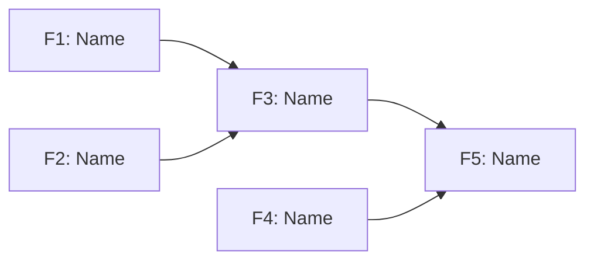

Extract features from a PRD into 02-FEATURES.md, organized around user journeys.

Ask clarifying questions if User Journeys section is missing or unclear.

## Process

1. Read `docs/{feature}/01-PRD.md`
2. Extract features following the process below
3. Create Context section summarizing the PRD
4. Save to `docs/{feature}/02-FEATURES.md`

## Extraction Process

### 1. Parse User Journeys

- Extract each journey from PRD's User Journeys section
- Break into discrete steps (user actions + system responses)
- Identify the happy path and variant flows

### 2. Map Features to Journey Steps

- For each step, identify required features from Functional Requirements
- Features enabling the same step are peers
- Features in sequence have dependency relationships
- Flag features appearing in multiple journeys (high-value, implement first)

### 3. Build Dependency Graph

- Feature A enables Feature B if A's journey step precedes B's
- Identify parallel features (no dependency, can build concurrently)
- Detect features not in any journey (standalone utilities)

### 4. Identify Critical Path

- Longest chain of blocking dependencies
- These features gate the most downstream work
- Prioritize critical path features for early implementation

### 5. Detail Each Feature

- Map to source PRD section
- List which journeys use it
- Define acceptance criteria from journey context

## 02-FEATURES.md Template

````markdown
# Features - {Product Name}

## Context

{Summarize the PRD in a concise format so we have context for all the features}

---

## Summary

| Priority     | Count |
| ------------ | ----- |
| Must have    | X     |
| Should have  | X     |
| Nice to have | X     |
| **Total**    | X     |

## User Journeys

### Journey 1: {Name}

{One-line description}

| Step | Action   | Features |
| ---- | -------- | -------- |
| 1    | {action} | F1, F2   |
| 2    | {action} | F3       |
| 3    | {action} | F4, F5   |

### Journey 2: {Name}

...

## Feature Graph


````

## Critical Path

Longest blocking chain - prioritize for early implementation:

`F1 -> F3 -> F5 -> F8`

## Feature Details

### F1: {Feature Name}

| Attribute  | Value          |
| ---------- | -------------- |
| Priority   | Must have      |
| Complexity | Medium         |
| Phase      | 1              |
| Source     | PRD §{Section} |
| Journeys   | 1, 2           |
| Enables    | F3, F4         |
| Blocked by | None           |

**Description:**
{What this feature does}

**Acceptance Criteria:**

- [ ] {Criterion derived from journey step}
- [ ] {Criterion from PRD requirements}

**Technical Notes:**
{Constraints, edge cases, integration points}

---

### F2: {Feature Name}

...

```

## Output

1. 02-FEATURES.md following template above
2. Every PRD requirement mapped to at least one feature
3. Every feature mapped to at least one journey (or marked standalone)
4. Context section summarizing PRD's key information
```
