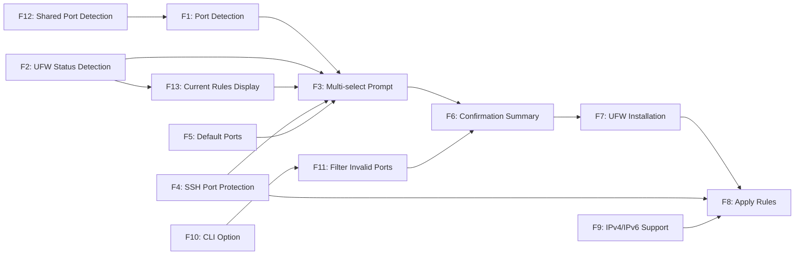

# Features - Server Firewall Command

## Context

The `server:firewall` command provides an interactive interface for managing UFW (Uncomplicated Firewall) rules on provisioned servers. Users can view all detected listening services and select which ports should be open, with the firewall automatically configured to deny all other traffic.

**Key Safety Requirement:** SSH access must never be accidentally blocked. The command uses the SSH port configured for the server (from ServerDTO) and ensures it's always included in allow rules.

**Target Users:** Server administrators who want simplified firewall management, and DevOps engineers who need scriptable firewall configuration.

**Technical Stack:** PHP Command (ServerFirewallCommand.php) + Bash Playbook (server-firewall.sh) + Shared Helper (helpers.sh)

---

## Summary

| Priority     | Count |
| ------------ | ----- |
| Must have    | 13    |
| Should have  | 0     |
| Nice to have | 0     |
| **Total**    | 13    |

## User Journeys

### Journey 1: Interactive Firewall Configuration

User interactively selects which ports to allow on their server.

| Step | Action                                      | Features     |
| ---- | ------------------------------------------- | ------------ |
| 1    | User runs `deployer server:firewall`        | -            |
| 2    | System prompts for server selection         | (ServersTrait) |
| 3    | System detects listening ports/services     | F1, F12      |
| 4    | System detects current UFW rules            | F2, F13      |
| 5    | System displays multi-select prompt         | F3, F4, F5   |
| 6    | User toggles selections and confirms        | F3           |
| 7    | System displays confirmation summary        | F6           |
| 8    | User confirms changes                       | F6           |
| 9    | System installs UFW if needed               | F7           |
| 10   | System resets UFW and applies rules (SSH first) | F8, F9   |
| 11   | System displays success message             | F8           |

### Journey 2: Non-Interactive (Scripted)

User configures firewall via CLI options without prompts.

| Step | Action                                          | Features     |
| ---- | ----------------------------------------------- | ------------ |
| 1    | User runs with `--server` and `--allow` options | F10          |
| 2    | System detects listening ports                  | F1, F12      |
| 3    | System filters `--allow` to detected ports only | F11          |
| 4    | System displays confirmation summary            | F6           |
| 5    | User confirms (or uses `--force`)               | F6           |
| 6    | System applies rules                            | F8, F9       |

### Journey 3: First-Time Setup (UFW Not Installed)

User runs firewall command on server without UFW installed.

| Step | Action                              | Features |
| ---- | ----------------------------------- | -------- |
| 1    | User runs `deployer server:firewall` | -        |
| 2    | System detects UFW not installed    | F7       |
| 3    | System installs UFW                 | F7       |
| 4    | Flow continues as Journey 1 step 3  | F1+      |

## Feature Graph

## Critical Path

Longest blocking chain - prioritize for early implementation:

`F12 -> F1 -> F3 -> F6 -> F7 -> F8`

---

## Feature Details

### F1: Port Detection

| Attribute  | Value                    |
| ---------- | ------------------------ |
| Priority   | Must have                |
| Complexity | Medium                   |
| Phase      | 1                        |
| Source     | PRD §F1                  |
| Journeys   | 1, 2, 3                  |
| Enables    | F3, F11                  |
| Blocked by | F12                      |

**Description:**
Detect all listening TCP and UDP ports with associated service names using `ss` or `netstat`.

**Acceptance Criteria:**

- [ ] Detects all TCP listening ports
- [ ] Detects all UDP listening ports
- [ ] Associates process/service name with each port
- [ ] Completes within 5 seconds (per NFR)
- [ ] Works on Ubuntu 20.04, 22.04, 24.04 and Debian 11, 12

**Technical Notes:**
Uses `ss -tulnp` command. Output format: `port:process` pairs. Shared implementation via F12.

---

### F2: UFW Status Detection

| Attribute  | Value       |
| ---------- | ----------- |
| Priority   | Must have   |
| Complexity | Low         |
| Phase      | 1           |
| Source     | PRD §F2     |
| Journeys   | 1           |
| Enables    | F3, F13     |
| Blocked by | None        |

**Description:**
Detect currently allowed ports in UFW rules to show current firewall state.

**Acceptance Criteria:**

- [ ] Parses `ufw status` output
- [ ] Extracts list of currently allowed ports
- [ ] Handles case where UFW is inactive
- [ ] Handles case where UFW is not installed

**Technical Notes:**
Parse `ufw status numbered` for rule extraction. Used to pre-check currently open ports in multi-select.

---

### F3: Multi-select Prompt

| Attribute  | Value              |
| ---------- | ------------------ |
| Priority   | Must have          |
| Complexity | Medium             |
| Phase      | 2                  |
| Source     | PRD §F3            |
| Journeys   | 1                  |
| Enables    | F6                 |
| Blocked by | F1, F2, F4, F5, F13 |

**Description:**
Display ports in format `{port} ({service})` with currently open ports pre-checked for user selection.

**Acceptance Criteria:**

- [ ] Displays all detected listening ports
- [ ] Format: `{port} ({service})` (e.g., "80 (caddy)")
- [ ] Pre-checks currently open UFW ports
- [ ] Pre-checks default ports (80, 443) per F5
- [ ] Excludes SSH port from display per F4
- [ ] Allows toggle selection

**Technical Notes:**
Uses IOService for prompts. SSH port hidden but always included in final allow list.

---

### F4: SSH Port Protection

| Attribute  | Value           |
| ---------- | --------------- |
| Priority   | Must have       |
| Complexity | Low             |
| Phase      | 2               |
| Source     | PRD §F4, NFRs   |
| Journeys   | 1, 2            |
| Enables    | F3, F8          |
| Blocked by | None            |

**Description:**
Never display the server's SSH port in selection list; always include in allow rules. SSH port comes from ServerDTO (configured during `server:add`).

**Acceptance Criteria:**

- [ ] SSH port never appears in multi-select list
- [ ] SSH port always included in final allow list
- [ ] Validated in both PHP command and bash playbook (defense in depth)
- [ ] Command aborts if SSH port validation fails
- [ ] Uses `$server->port` from ServerDTO

**Technical Notes:**
Critical safety feature. Playbook receives SSH port via `DEPLOYER_SSH_PORT` env var. Playbook must validate this is set and included in allowed ports before any UFW operations.

---

### F5: Default Ports

| Attribute  | Value       |
| ---------- | ----------- |
| Priority   | Must have   |
| Complexity | Low         |
| Phase      | 2           |
| Source     | PRD §F5     |
| Journeys   | 1           |
| Enables    | F3          |
| Blocked by | None        |

**Description:**
Pre-check ports 80 and 443 by default in addition to currently open ports.

**Acceptance Criteria:**

- [ ] Port 80 pre-checked if detected as listening
- [ ] Port 443 pre-checked if detected as listening
- [ ] Combined with currently open UFW ports for initial selection

**Technical Notes:**
Only pre-check if port is in detected listening ports list (don't pre-check non-listening ports).

---

### F6: Confirmation Summary

| Attribute  | Value       |
| ---------- | ----------- |
| Priority   | Must have   |
| Complexity | Medium      |
| Phase      | 2           |
| Source     | PRD §F6     |
| Journeys   | 1, 2        |
| Enables    | F7, F8      |
| Blocked by | F3 or F11   |

**Description:**
Show summary of changes (ports to open, ports to close) before applying. User must confirm.

**Acceptance Criteria:**

- [ ] Shows ports that will be opened
- [ ] Shows ports that will be closed
- [ ] Shows "SSH port will remain open" message
- [ ] Requires yes/no confirmation
- [ ] Shown in 100% of cases (per success metrics)

**Technical Notes:**
Compare current UFW state with selected ports to compute delta. Format per PRD examples.

---

### F7: UFW Installation

| Attribute  | Value       |
| ---------- | ----------- |
| Priority   | Must have   |
| Complexity | Low         |
| Phase      | 2           |
| Source     | PRD §F7     |
| Journeys   | 1, 2, 3     |
| Enables    | F8          |
| Blocked by | F6          |

**Description:**
Install UFW if not present on the server.

**Acceptance Criteria:**

- [ ] Detects if UFW is installed
- [ ] Installs UFW via apt if not present
- [ ] Displays "UFW is not installed. Installing..." message
- [ ] Works on Ubuntu and Debian

**Technical Notes:**
Use `which ufw` or `command -v ufw` for detection. Install via `apt-get install -y ufw`.

---

### F8: Apply Rules

| Attribute  | Value           |
| ---------- | --------------- |
| Priority   | Must have       |
| Complexity | High            |
| Phase      | 2               |
| Source     | PRD §F8         |
| Journeys   | 1, 2            |
| Enables    | None            |
| Blocked by | F4, F6, F7, F9  |

**Description:**
Reset all UFW rules, set default deny, allow selected ports + SSH port. Must be atomic and SSH-safe.

**Acceptance Criteria:**

- [ ] Allow SSH port BEFORE any reset operation
- [ ] Reset UFW to clear all rules
- [ ] Re-allow SSH immediately after reset
- [ ] Set default deny incoming
- [ ] Set default allow outgoing
- [ ] Allow user-selected ports
- [ ] Enable UFW if not already enabled
- [ ] Idempotent: same selection produces same result

**Technical Notes:**
Order is critical for SSH safety:

1. `ufw allow $SSH_PORT/tcp` + `/udp`
2. `ufw --force reset`
3. `ufw allow $SSH_PORT/tcp` + `/udp`
4. `ufw default deny incoming`
5. `ufw default allow outgoing`
6. Allow selected ports
7. `ufw --force enable`

---

### F9: IPv4/IPv6 Support

| Attribute  | Value       |
| ---------- | ----------- |
| Priority   | Must have   |
| Complexity | Low         |
| Phase      | 2           |
| Source     | PRD §F9     |
| Journeys   | 1, 2        |
| Enables    | F8          |
| Blocked by | None        |

**Description:**
Apply rules to both IPv4 and IPv6.

**Acceptance Criteria:**

- [ ] UFW rules apply to IPv4
- [ ] UFW rules apply to IPv6
- [ ] Verified in test environments

**Technical Notes:**
UFW handles IPv4/IPv6 automatically when rules are added without IP specification. Verify IPv6 is enabled in `/etc/default/ufw` (IPV6=yes).

---

### F10: CLI Option

| Attribute  | Value       |
| ---------- | ----------- |
| Priority   | Must have   |
| Complexity | Medium      |
| Phase      | 3           |
| Source     | PRD §F10    |
| Journeys   | 2           |
| Enables    | F11         |
| Blocked by | None        |

**Description:**
Support `--allow=80,443,3306` for non-interactive execution.

**Acceptance Criteria:**

- [ ] Accepts `--allow` option with comma-separated port list
- [ ] Skips multi-select prompt when `--allow` provided
- [ ] Works with `--server` option for full non-interactive flow
- [ ] Still shows confirmation unless `--force` used

**Technical Notes:**
Parse comma-separated values. Validate each is numeric. Pass to F11 for filtering.

---

### F11: Filter Invalid Ports

| Attribute  | Value       |
| ---------- | ----------- |
| Priority   | Must have   |
| Complexity | Low         |
| Phase      | 3           |
| Source     | PRD §F11    |
| Journeys   | 2           |
| Enables    | F6          |
| Blocked by | F1, F10     |

**Description:**
`--allow` ports not in detected listening ports are silently filtered out.

**Acceptance Criteria:**

- [ ] Filters `--allow` list to only detected listening ports
- [ ] Displays note about filtered ports (e.g., "Port 9999 is not a listening service and will be ignored")
- [ ] Final list only contains valid, listening ports + SSH

**Technical Notes:**
Intersection of `--allow` ports with detected ports. Always add SSH port regardless of detection.

---

### F12: Shared Port Detection

| Attribute  | Value       |
| ---------- | ----------- |
| Priority   | Must have   |
| Complexity | Medium      |
| Phase      | 1           |
| Source     | PRD §F12    |
| Journeys   | 1, 2, 3     |
| Enables    | F1          |
| Blocked by | None        |

**Description:**
Extract port detection logic into `playbooks/helpers.sh` for reuse with `server-info.sh`.

**Acceptance Criteria:**

- [ ] `get_listening_services()` function in `helpers.sh`
- [ ] Returns port:process pairs for TCP and UDP
- [ ] `server-info.sh` updated to use shared helper
- [ ] `server-firewall.sh` uses shared helper
- [ ] DRY: no duplicated port detection code

**Technical Notes:**
Source helpers.sh in both playbooks. Function signature: `get_listening_services()` outputs parseable format.

---

### F13: Current Rules Display

| Attribute  | Value       |
| ---------- | ----------- |
| Priority   | Must have   |
| Complexity | Low         |
| Phase      | 2           |
| Source     | PRD §F13    |
| Journeys   | 1           |
| Enables    | F3          |
| Blocked by | F2          |

**Description:**
Show current UFW status before prompting for port selection.

**Acceptance Criteria:**

- [ ] Displays current UFW status (active/inactive)
- [ ] Shows currently allowed ports before multi-select
- [ ] Provides context for user's selection

**Technical Notes:**
Display parsed output from F2 (UFW Status Detection) before showing multi-select prompt.
