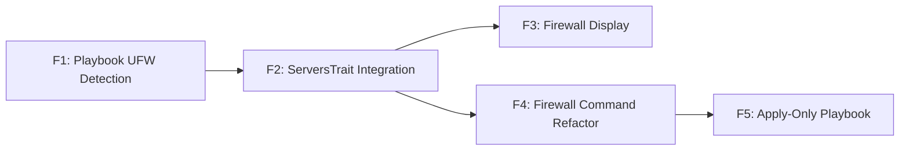

# Features - Server Info Firewall Display

## Context

Extend `server:info` to display firewall status and open ports (matching `server:firewall` output format). Consolidate UFW detection into `server-info` playbook for single SSH call and data reuse. Refactor `server:firewall` to reuse shared detection from `serverInfo()` method.

**Key constraints:**

- No additional SSH calls (integrate into existing playbook)
- Output format must match `server:firewall` exactly
- Existing `server:info` sections unchanged (firewall is additive)

---

## Summary

| Priority  | Count |
| --------- | ----- |
| Must have | 5     |
| **Total** | 5     |

## User Journeys

### Journey 1: View Complete Server Status

User runs `server:info` and sees all system information including firewall status and open ports in a single output.

| Step | Action                         | Features |
| ---- | ------------------------------ | -------- |
| 1    | User runs `server:info`        | -        |
| 2    | Playbook detects UFW status    | F1       |
| 3    | Command receives firewall data | F2       |
| 4    | Display firewall section       | F3       |

### Journey 2: Configure Firewall

User runs `server:firewall`, which uses shared detection mechanism before showing configuration options.

| Step | Action                           | Features |
| ---- | -------------------------------- | -------- |
| 1    | User runs `server:firewall`      | -        |
| 2    | Command calls `serverInfo()`     | F4       |
| 3    | Display current firewall status  | F3       |
| 4    | Show configuration options       | -        |
| 5    | Apply changes via apply playbook | F5       |

## Feature Graph

## Critical Path

Longest blocking chain - prioritize for early implementation:

`F1 -> F2 -> F3`

## Feature Details

### F1: Playbook UFW Detection

| Attribute  | Value                                                 |
| ---------- | ----------------------------------------------------- |
| Priority   | Must have                                             |
| Complexity | Medium                                                |
| Phase      | 1                                                     |
| Source     | PRD §Functional Requirements, §Implementation Phase 1 |
| Journeys   | 1, 2                                                  |
| Enables    | F2                                                    |
| Blocked by | None                                                  |

**Description:**
Add UFW detection logic to `server-info` playbook. Detect firewall installation status, active/inactive state, and extract current UFW rules with port-to-process mapping.

**Acceptance Criteria:**

- [ ] Playbook detects if UFW is installed
- [ ] Playbook detects if UFW is active or inactive
- [ ] Playbook extracts UFW rules (port/protocol format)
- [ ] Playbook maps ports to process names using existing `get_listening_services()` helper
- [ ] Returns YAML with `ufw_installed`, `ufw_active`, `ufw_rules` array, and firewall `ports` object

**Technical Notes:**

- Reuse detection logic from `server-firewall.sh` detect mode
- Must work within single SSH call (no separate playbook execution)
- Handle case where UFW commands not available (not installed)

---

### F2: ServersTrait Integration

| Attribute  | Value                                |
| ---------- | ------------------------------------ |
| Priority   | Must have                            |
| Complexity | Low                                  |
| Phase      | 1                                    |
| Source     | PRD §Functional Requirements, §Scope |
| Journeys   | 1, 2                                 |
| Enables    | F3, F4                               |
| Blocked by | F1                                   |

**Description:**
Update `serverInfo()` method in `ServersTrait` to include firewall data in its return value. The firewall data from the playbook should be passed through without transformation.

**Acceptance Criteria:**

- [ ] `serverInfo()` return array includes firewall keys (`ufw_installed`, `ufw_active`, `ufw_rules`, firewall `ports`)
- [ ] Firewall data available to any command calling `serverInfo()`
- [ ] No changes to existing return data structure (additive only)

**Technical Notes:**

- Data flows through from playbook YAML output automatically
- No explicit code changes needed if playbook outputs correct keys
- Verify `ServerInfoCommand` calls `serverInfo()` or equivalent

---

### F3: Firewall Display

| Attribute  | Value                        |
| ---------- | ---------------------------- |
| Priority   | Must have                    |
| Complexity | Medium                       |
| Phase      | 1                            |
| Source     | PRD §Functional Requirements |
| Journeys   | 1, 2                         |
| Enables    | None                         |
| Blocked by | F2                           |

**Description:**
Display "Firewall" section in `server:info` output with status and open ports. Format must be identical to `server:firewall` detection display. Ensure consistent port display format with existing "Services/Ports" section.

**Acceptance Criteria:**

- [ ] Displays "Firewall: Active", "Firewall: Inactive", or "Firewall: Not installed"
- [ ] When active, displays "Open Ports" with `Port {number}` => `{process_name}` format
- [ ] Output format identical to `server:firewall` detection display
- [ ] Port display format consistent between "Services/Ports" and "Firewall/Open Ports" sections
- [ ] Firewall section appears as distinct section in output

**Technical Notes:**

- Reuse `displayCurrentStatus()` logic from `ServerFirewallCommand` or extract shared method
- Use `displayDeets()` for formatted output (BaseCommand method)
- Consider extracting display logic to trait for reuse

---

### F4: Firewall Command Refactor

| Attribute  | Value                                                 |
| ---------- | ----------------------------------------------------- |
| Priority   | Must have                                             |
| Complexity | Medium                                                |
| Phase      | 2                                                     |
| Source     | PRD §Functional Requirements, §Implementation Phase 2 |
| Journeys   | 2                                                     |
| Enables    | F5                                                    |
| Blocked by | F2                                                    |

**Description:**
Refactor `ServerFirewallCommand` to use `serverInfo()` for detection phase instead of calling `server-firewall` playbook in detect mode. Ensures consistent firewall status reporting between commands.

**Acceptance Criteria:**

- [ ] `server:firewall` uses `serverInfo()` for initial firewall detection
- [ ] Detection output identical to current behavior
- [ ] No duplicate detection playbook calls
- [ ] Interactive port selection still works with data from `serverInfo()`

**Technical Notes:**

- Replace `executePlaybook('server-firewall', ['DEPLOYER_MODE' => 'detect'])` with `serverInfo()` call
- Map `serverInfo()` return keys to expected variables in command
- Preserve all existing functionality (port selection, apply flow)

---

### F5: Apply-Only Playbook

| Attribute  | Value                                                 |
| ---------- | ----------------------------------------------------- |
| Priority   | Must have                                             |
| Complexity | Low                                                   |
| Phase      | 2                                                     |
| Source     | PRD §Functional Requirements, §Implementation Phase 2 |
| Journeys   | 2                                                     |
| Enables    | None                                                  |
| Blocked by | F4                                                    |

**Description:**
Remove detection logic from `server-firewall` playbook, keeping only the apply mode functionality. Detection is now handled by `server-info` playbook.

**Acceptance Criteria:**

- [ ] `server-firewall` playbook only handles apply mode
- [ ] Detect mode code removed from `server-firewall` playbook
- [ ] Apply mode unchanged (SSH safety, rule application, enable UFW)
- [ ] No orphaned code or unused functions in playbook

**Technical Notes:**

- Keep `DEPLOYER_MODE=apply` logic intact
- Remove `DEPLOYER_MODE=detect` branch and related functions
- Verify `server:firewall` command no longer calls detect mode
